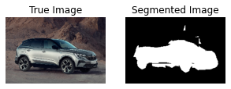

# Semantic segmentation in PyTorch using U-Net
<!-- ----------------------------------------------- -->

This is a simple example of implementing semantic segmentain using PyTorch.

## Download data
Download the data using 
```console
$ bash data_scripts/download_data.sh
```
If it requires, enter your username and API key from [Kaggle](https://www.kaggle.com/docs/api#authentication) to download the data.
You should also accept the terms and conditions of [Carvana Image Masking Challenge](https://www.kaggle.com/competitions/carvana-image-masking-challenge) on Kaggle.

## Train
To train the network, use
```console
$ python train.py --data_dir <data_dir>
```
Other options are
```console
-h, --help                  show this help message and exit
--data_dir DATA_DIR         Data directory
--result_dir RESULT_DIR     Directory to save checkpoints, loss, and some examples
--epochs EPOCHS             Number of epochs for training
--batch_size BATCH_SIZE     Size of batches
--val_percentage VAL_PERCENTAGE Relative size of validation set in percentage [0, 1.0]
--learning_rate LEARNING_RATE   Learning rate
--device {cpu,cuda}         Name of device for training (cpu, cuda)
```

Default values and other options are available in `default_values.py`. 

## Results
Now, can use the trained model to segment any other car images.
As an example, we can see here an image and the segmented result which is not a part of the Carvana dataset.


It seems the model could do a good sementation.
However, almost all used images in this study had a white background. 
This means, the accuracy should be low if we use this model to segment an image with not-white background.




## Train on Google Colab
To train the network on Google Colab, please use the provided [jupyter notebook](https://github.com/AmirMardan/deep-learning-algorithms/blob/main/0_img_segmentation/1_unet_carvana/run_colab.ipynb).


