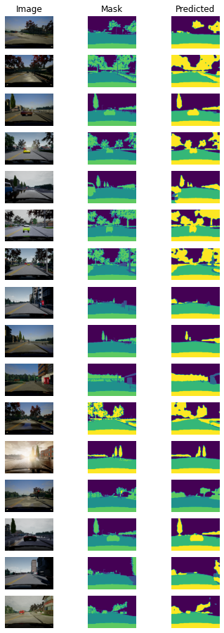
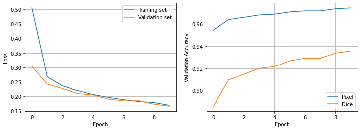

# Multiclass Semantic segmentation in PyTorch using U-Net
<!-- ----------------------------------------------- -->

This is a simple example of implementing multiclass semantic segmentain using PyTorch.

## Download data
Download the data using 
```console
$ bash data_scripts/download_data.sh
```
If it requires, enter your username and API key from [Kaggle](https://www.kaggle.com/docs/api#authentication) to download the data.

## Train
To train the network, use
```console
$ python train.py --data_dir <data_dir>
```
Other options are
```console
-h, --help                  show this help message and exit
--data_dir DATA_DIR         Data directory
--result_dir RESULT_DIR     Directory to save checkpoints, loss, and some examples
--epochs EPOCHS             Number of epochs for training
--batch_size BATCH_SIZE     Size of batches
--val_percentage VAL_PERCENTAGE Relative size of validation set in percentage [0, 1.0]
--learning_rate LEARNING_RATE   Learning rate
--device {cpu,cuda}         Name of device for training (cpu, cuda)
```

Default values and other options are available in [`default_values.py`](https://github.com/AmirMardan/deep_learning_algorithms/blob/main/1_img_segmentation/2_unet_multiclass/default_values.py). 

## Results
Here we can see some results of running this code with 10 epochs and default parameters presented [`default_values.py`](https://github.com/AmirMardan/deep_learning_algorithms/blob/main/1_img_segmentation/2_unet_multiclass/default_values.py).



The following figure shows the loss for training and validation sets in addition to the accuracy of the model on validation data. 




## Train on Google Colab
To train the network on Google Colab, please use the provided [jupyter notebook](https://github.com/AmirMardan/deep_learning_algorithms/blob/main/1_img_segmentation/2_unet_multiclass/run_colab.ipynb).


